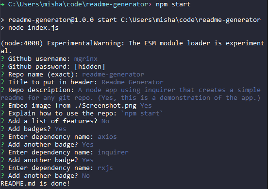

# Readme Generator
A node app using inquirer that creates a simple readme for any git repo. (Yes, this is a demonstration of the app.)  

## Table of Contents
- [Usage](#Usage)

- [Contributors](#Contributors)
- [Dependencies](#Dependencies)
## Usage
### [Try it!]()
`npm start`

## Contributors
<iframe src="https://githubbadge.appspot.com/mgrinx" style="border: 0;height: 111px;width: 200px;overflow: hidden;" frameBorder="0"></iframe>

## Dependencies

